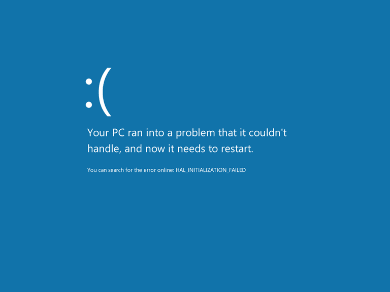

Throughout my time in the Computer Engineering department, [Stack Overflow](https://stackoverflow.com/) has been a constant resource.  The forum helped me understand terminology that were mentioned throughout my object-oriented programming course.  It also helped me to understand concepts that were present in my Sophmore project, such as hash-maps, sockets, and Git.  Everytime I saw a Stack Overflow result from a Google search, I knew that there would be a good explanation for the topic.  In the case where the explanation wasn't the answer I needed, it would at least give me enough information to ask a better question.

One of the things that I found useful on Stack Overflow is ["How to undo the most recent commits in Git?"](https://stackoverflow.com/questions/927358/how-to-undo-the-most-recent-commits-in-git).  In the post, they briefly and concisely explain the situation (accidentally committed wrong files, but didn't push) and what they wanedt to do.  In this, a few of the responses did point at other sources, however, there were still many who answered with the various ways to fix the problem with slightly differing results.  Another useful post that I found was ["How do I delete a Git branch both locally and remotely?"](https://stackoverflow.com/questions/2003505/how-do-i-delete-a-git-branch-both-locally-and-remotely).  In this one, they add in a block of code with the commands that they tried along with the messages returned.  In this one, the answers were very informative, covering how to do each as well as detailing what was happening with the local and remote repositories.

Recently though, I was in a situation where I "knew" what was wrong and asked for help from an expert.  After setting up an appointment for later in the day, I questioned the issue: "what was the problem?", "what have I tried?", "what were my results?", and most importantly "does my conclusion make sense?".  Twenty minutes later I had cancelled the appointment because my issue had been resolved quite easily.  The main problem was that I didn't want to think through the entire situation and really examine what was really happening.  Looking through the depths of Stack Overflow show that I'm not the only one who asks for help before they completely examine the situation.  

Searching the numerous downvoted questions of Stack Overflow brought up some especially lazy questions.  These included titles such as ["Make this script work"](https://stackoverflow.com/questions/32590751/make-this-script-work) and ["How to open a url in a new window"](https://stackoverflow.com/questions/20507661/how-to-open-a-url-in-a-new-window).  In the first one, the answer is given in a demeaning way, with the poster calling it "an obvious, and trivial, way of doint it", while in the latter one, all of the responses can be split into sarcasm or pointing to google.

## Questioning 101

In Eric Raymond's guide, [How To Ask Questions The Smart Way](http://www.catb.org/esr/faqs/smart-questions.html), he details what you should, and shouldn't do when you ask a question.  There are a lot of sections, however it seems that certain things are mentioned various times in different ways.  Most of them can be divided into describe relevant information, trying to find an answer yourself, asking the right people, and making it easy to reply.  Basically: "how do we help you if you don't provide enough information to understand what is wrong?", "why should we put in extra effort to help you if you can't put in the minimum effort needed?".
